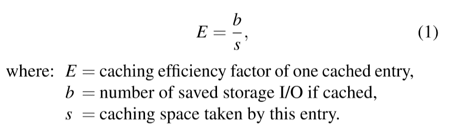
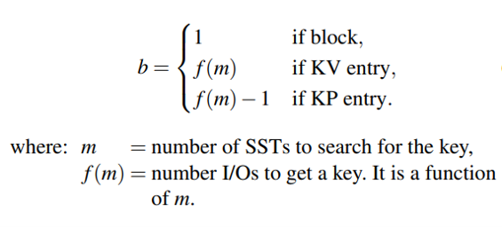
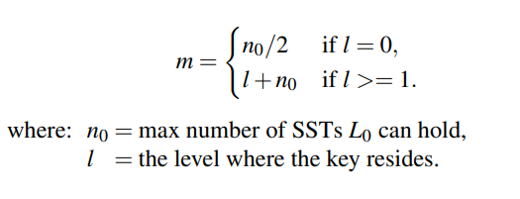
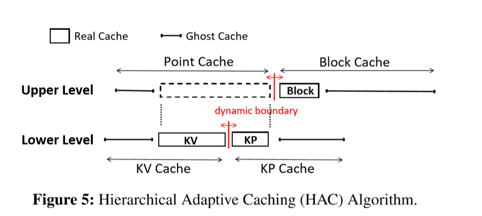

LSM Tree 是一种对写友好但是对读不友好的数据库。LSM Tree 在查找一个 key-value 的时候需要先在 memtable 中查找，然后是各个层级的 SST 中去查找，所以查找一个 key-value 的时候需要多次 I/O 操作，这对于读多场景下的性能是有很大的影响的。

有多种方法可以优化 LSM Tree 下的读取性能，AC-Key 这篇文章是从缓存角度来进行优化。

给 LSM-Tree 实现 cache 有几个挑战：
1. LSM是一个分层的数据结构，那么根据kv对所处的层级不同，cache命中带来的收益也是不同的。根据LSM读取数据的方式，一般来说，kv对所处的层级越深，那么cache命中带来的收益就越大。因为KV对的大小并不是固定的，所以LSM树的缓冲策略需要做到缓冲的数据所占用的DRAM空间与节省的IO之间的平衡。
2. 对于点查与范围查询这两种类型的工作负载需要采用不同的缓冲策略。依赖来说缓冲kv对有助于调查，缓冲blockcache有助于范围查询和点查，另外，对于大value可以选择缓冲value的pointer。对于这三种类型的cache，如何动态调整它们的内存占比，以便获取最大的收益是一个挑战。

因此单一的传统的缓存算法在 LSM-Tree 上的效果并不好。

# 设计
需要考虑4个点：
1. 缓存KV和KP条目的优点应该结合起来，以有效地提供点查找服务。
2. 缓存块和KV/KP条目各自具有支持范围查询和点查找的优势。
3. 缓存算法应该考虑不同缓存条目所占用的DRAM大小和节省的存储I/O数量的差异，尊重LSM-KVS的独特分层结构。
4. 缓存算法应该适应工作负载的变化。

## Caching Efficiency Factor
论文提出了一个缓存因子 E 来权衡 cache benefit 和 cache cost 之间的关系。

E 是节省的 IO 次数和所占的 cache space 之间的比值。这个 E 在文章中用在两个地方
1. ARC 中 L1 和 L2 之间容量的调整
2. LRU 替换策略

（这个 E 是否可以使用 AI 来辅助确定？）

b 的计算方式：

通常，f(m) = m + 2，其中我们必须从搜索路径上的每个SST中读取 m 个布隆过滤器，以及包含查找键的 SST 中的一个索引块和一个数据块。要搜索的SST的数量 m 是由键所在的级别 l 估计的。

m 的计算方式：

## E-LRU
E-LRU 检查最少使用的 a 条缓存条目，并清除具有最小缓存效率 E 的条目。a 的值取决于缓存条目的缓存效率因子 E 的方差。$ a=e^v$ ，v 是缓存中采样条目的缓存效率因子 E 的标准差。v 越大表示 E 的方差越大，所以我们需要检查更多的条目（不知道为什么以 e 为底，可能是惯例？）。

## HAC

1. cache 总体架构如图，是个分层的 [ARC](../arc)
    
    * 第一层是 Point Cache 和 Block Cache
    * 第二层是 Point Cache 的 KV Cache 和 KP Cache
2. boundary 移动规则（也就是 p）

    *  当KV ghost cache或KP ghost cache命中时，都会导致point cache的size增大，而只有当增大的size达到了一个block的size时，point cache与block cache之间的boundary才会真正向block cache侧移动。
    * 当block ghost cache命中时，会导致point cache的size减小，此时KV cache以及KP cache按照他们size的比例对应减小。

我们来看一下 E-ARC 是如何处理缓存命中和缓存缺失的：

**lower-level**

($R_{kv}$ 是 KV Real Cache，$R_{kp}$ 是 KP Real Cache)
* Case 1: Real Cache Hit. Cache 命中 $R_{kv}$ 或者 $R_{kp}$。 则移动命中的 entry 到 $R_{kv}$ 的 MRU 端。KP 的也要移到 KV。
* Case 2: KV Ghost Cache Hit. 命中在 $G_{kv}$ 意味着 $R_{kv}$ 的大小应该增大，将 boundary 向 KP Cache 移动 $\delta=kE$
* Case 3: KP Ghost Cache Hit. boundary 向 KV 移动。
* Case 4: Cache Miss. 从存储中检索条目并以 KP 格式缓存到 $R_{kp}$ 中。为了为这个 KP 条目腾出空间，如果目标边界在 KV 缓存内，则从$R_{kv}$ 中清除。否则，从 $R_{kp}$ 中清除。

**upper-level**

替换策略和 boundary 移动跟 low-level 一样。

* entry 淘汰后会记录在 Upper-Level 的 Ghost Point Cache，以及 Lower-Level 的 Ghost KV Cache 或 Ghost KP Cache。即会记录两次
* Block Cache 淘汰掉的 Block 会记录在 Ghost Block Cache
* 如果Ghost Point Cache被命中，Lower-Level 的 boundary 会先调整，然后 Upper-Level 的 boundary 再调整。
* Upper-Level 的 boundary 单次调整长度： $\Delta=kE$
* Point Cache 的变化会按如下公式分配给 KP Cache 和 KV Cache

    * $|R_{kv}^*| \gets |R_{kv}^*| - \Delta\frac{|R_{kv}^*|}{|R_{kv}^*| + |R_{kp}^*|}$
    * $|R_{kp}^*| \gets |R_{kp}^*| - \Delta\frac{|R_{kp}^*|}{|R_{kv}^*| + |R_{kp}^*|}$
* 节省 Ghost Cache 空间的占用
    
    * 使用一个4Byte的哈希签名代替 key 存入 Ghost Cache，但是因为碰撞会出现假阳性的问题。
    * 如果 entry 很多时 Ghost Cache 依然会占用大量的空间，所以当cache命中率波动小于阈值 $\theta$（默认为5%）则会关闭 Ghost Cache，释放空间给 Real Cache。当波动大于阈值Θ时重新开启 Ghost Cache

3. boundary 移动距离：$\delta=kE=k{\frac{b}{s}}$

## 读写流程
要解决 SST 和 cache 之间的数据同步，Memtable 和 cache 之间的数据同步。
### Flush
如果 memtable 内存在比 cache 新的记录，那么系统在 flush 后可能会返回 cache 内过时的数据，所以 AC-Key 在 Flush 期间需会对 cache 内的数据做同步。
### Compaction
* compaction 会导致部分 KP Cahce 和 Block Cache 失效
* 对于 KP cache 来说，只需要将对应的指针更新为 compaction 后的新地址。
* 对于 block cache 来说，需要移除失效的 block，并以 key 范围与之有最大重叠的新 block 代替。

# 实现
https://github.com/fgwu/caching/tree/fwu_uni_cache_arc
