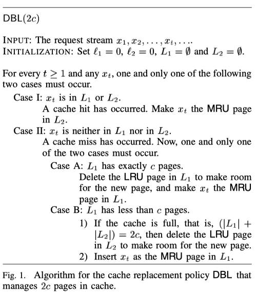
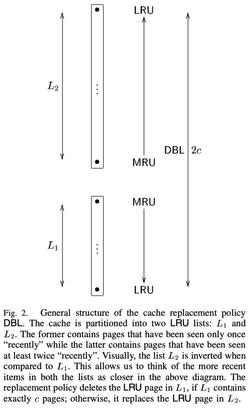
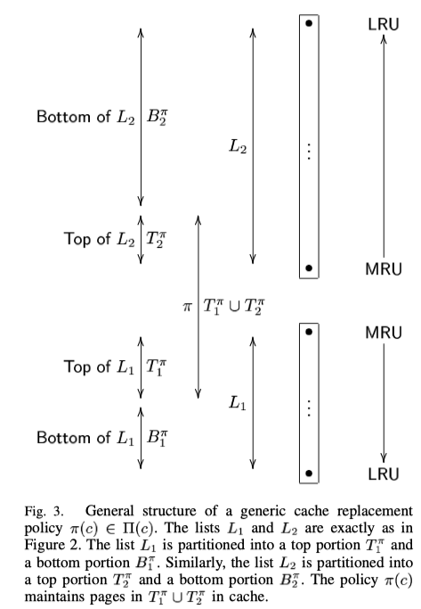
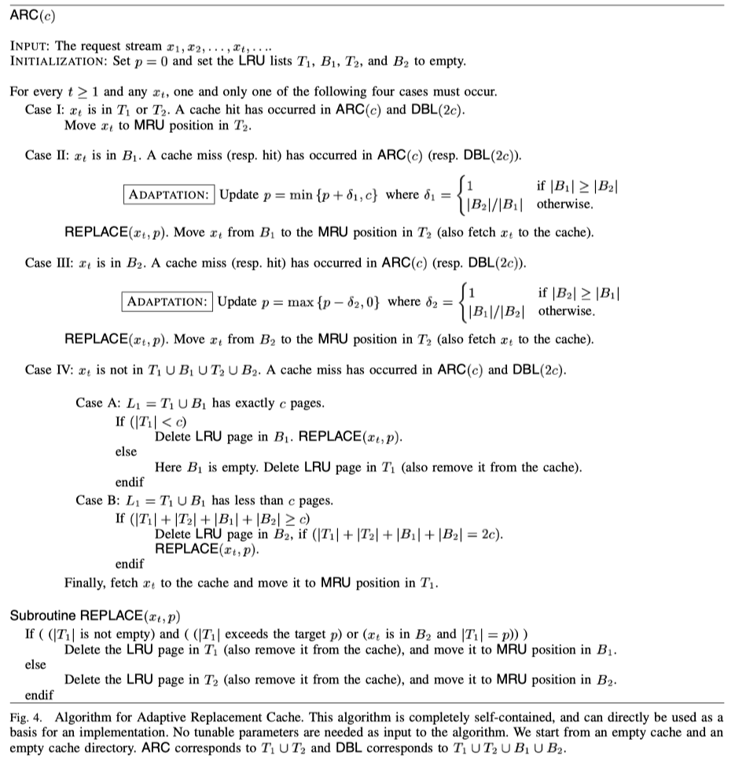

Arc 是一种 LRU 改进算法，在很多负载环境中性能优于常用的 LRU 算法。

# 基本思想
我们需要先了解一下什么是 recency，什么是 frequency。recency 是最近访问时间，frequency 是访问频率。LRU 只基于了 recency，LFU 基于 frequency。所以这两个算法都没有同时利用好 frequency 和 recency，所以在面对不同 workload 的时候性能会有所下降。ARC 其实就是结合了 recency 和 frequency。

## DBL
作者在论文中先引入 DBL 这个算法。 DBL 提出用两个 LRU 来缓存。一个为 L1，用来存放首次访问的数据，另外一个为 L2，用来存放至少访问了两次的数据。如果一个 LRU 的大小是 c，则总的缓存大小是 2c。

Fig.1 是 DBL 的算法。

也就是说，如果 x 在 L1 或 L2 中，则将 x 移到 L2 的 MRU 端。如果都不在，分为两种情况：第一种是 L1 有 c 个缓存项了。则需要删掉 L1 中的一个页面，然后将 x 放到 L1 的 MRU 端。第二种情况是L1 少于 c 个缓存项，但是如果总的缓存项等于 2c，则需要删掉 L2 LRU 端的项来存放 x。如果小于 2c，则直接插入 L1 的 MRU。（不清楚 LRU 和 MRU 分别指什么的可以看 Fig 2）

下图是 DBL 的结构

## ARC
但是如果我们的缓存大小只有 c 个的情况下就使用不了 DBL 了。这时候我们可以将 DBL 进行一个改进。我们可以将 L1 的大小设置为 p，那 L2 的大小设置为 c-p。剩下的 c 我们不存放实际的值，用于存放项的索引。所以这时候缓存的大小可以近似为 c，这就是 ARC 算法。如下图所示

那我们需要如何去调整 p 的大小呢？(固定 P 大小是 FRC 算法) p值决定了当缓存没命中，即遇到首次访问的数据时，是否从T1中淘汰数据块。若目前 T1 长度小于 p，说明还没记录够 p 个最近只访问一次的数据，于是从 T2 淘汰数据块至 B2，T1 长度增加。若目前 T1 长度大于等于 p（若 p 值固定，理论是不会大于 p 的）则直接从 T1 替换数据块，被替换的数据块下层至 B1，T1 长度不变。若目前 T1 长度小于 p，说明还没记录够 p 个最近只访问一次的数据，于是从 T2 淘汰数据块至 B2，T1 长度增加。若目前 T1 长度大于等于 p（若 p 值固定，理论是不会大于 p 的）则直接从 T1 替换数据块，被替换的数据块下层至 B1，T1 长度不变。
下图是 ARC 算法：

# 实现
https://github.com/uran0sH/cache/blob/main/arc.h
https://github.com/uran0sH/cache/blob/main/arc.cc

> ref:
> 1. ARC: A Self-Tuning, Low Overhead Replacement Cache
> 2. https://zhuanlan.zhihu.com/p/522306900
> 3. http://hcoona.github.io/Paper-Note/arc-one-up-on-lru/#figure-1