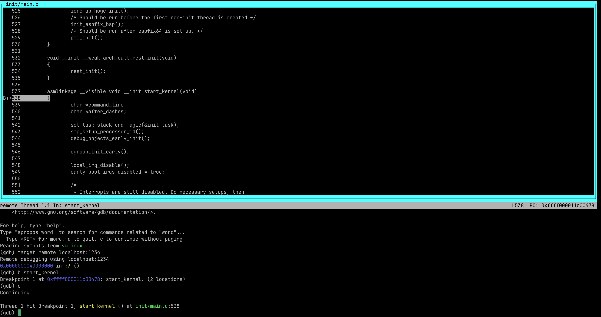

第一步先进行源码拉取，这里使用的是一个特别版本：https://github.com/runninglinuxkernel/runninglinuxkernel_5.0.git

我们还需要下载 ARM 编译工具链：https://developer.arm.com/downloads/-/arm-gnu-toolchain-downloads (我使用的是[10.3](https://developer.arm.com/downloads/-/gnu-a)的版本)

# 编译 Kernel
`run_rlk_arm64.sh` 这段脚本中提供了下面这几行代码来编译 kernel:

```shell
make_kernel_image(){
	echo "start build kernel image..."
	make debian_defconfig
	make -j $JOBCOUNT
}
```
运行：
```
./run_rlk_arm64.sh build_kernel
```
从上面的代码可以看出，编译内核只需要两步：
1. 配置编译选项：`make menuconfig` 或者 `make %_defconfig`。 `menuconfig` 是 Linux 提供的一种文字式图形化配置方式，依赖 `libncurses5-dev`。`make %_defconfig` 会依赖下面的这几行，在固定的路径去读取相应的 config 文件
```makefile
# scripts/kconfig/Makefile

%_defconfig: $(obj)/conf
	$(Q)$< $(silent) --defconfig=arch/$(SRCARCH)/configs/$@ $(Kconfig)
```
2. `make -j$(nproc)` 编译

如果是替换本机的 Linux 内核还需要做以下的几步：
3. `make modules_install`
4. `make install`
# 编译 rootfs
```shell
kernel_build=$PWD/rootfs_debian_arm64/usr/src/linux/

prepare_rootfs(){
	if [ ! -d $rootfs_path ]; then
		echo "decompressing rootfs..."
		# split -d -b 80m rootfs_debian_arm64.tar.xz -- rootfs_debian_arm64.part 
		cat rootfs_debian_arm64.part0* > rootfs_debian_arm64.tar.xz
		tar -Jxf rootfs_debian_arm64.tar.xz
	fi
}

build_kernel_devel(){
	kernver="$(cat include/config/kernel.release)"
	echo "kernel version: $kernver"

	mkdir -p $kernel_build
	rm rootfs_debian_arm64/lib/modules/$kernver/build
	cp -a include $kernel_build
	cp Makefile .config Module.symvers System.map vmlinux $kernel_build
	mkdir -p $kernel_build/arch/arm64/
	mkdir -p $kernel_build/arch/arm64/kernel/

	cp -a arch/arm64/include $kernel_build/arch/arm64/
	cp -a arch/arm64/Makefile $kernel_build/arch/arm64/
	cp arch/arm64/kernel/module.lds $kernel_build/arch/arm64/kernel/

	ln -s /usr/src/linux rootfs_debian_arm64/lib/modules/$kernver/build

	# ln to debian linux-5.0/scripts
	ln -s /usr/src/linux-kbuild/scripts rootfs_debian_arm64/usr/src/linux/scripts
	#ln -s /usr/src/linux-kbuild/tools rootfs_debian_arm64/usr/src/linux/tools
}

build_rootfs(){
	if [ ! -f $rootfs_image ]; then
		make install
		make modules_install -j $JOBCOUNT
		# make headers_install

		build_kernel_devel

		echo "making image..."
		dd if=/dev/zero of=$rootfs_image bs=1M count=$rootfs_size
		mkfs.ext4 $rootfs_image
		mkdir -p tmpfs
		echo "copy data into rootfs..."
		mount -t ext4 $rootfs_image tmpfs/ -o loop
		cp -af $rootfs_path/* tmpfs/
		umount tmpfs
		chmod 777 $rootfs_image

		rm -rf $rootfs_path
	fi
}
```

# 使用 Qemu 运行
1. 编译 QEMU，编译选项记得开启 `--enable-kvm --enable-virtfs`
2. 使用下面的脚本运行
```shell
run_qemu_debian(){
	cmd="$QEMU -m 1024 -cpu cortex-a57 -smp 4 -M virt,gic-version=3,its=on,iommu=smmuv3\
		-nographic $SMP -kernel arch/arm64/boot/Image \
		-append \"$kernel_arg $debug_arg $rootfs_arg $crash_arg $dyn_arg\"\
		-drive if=none,file=$rootfs_image,format=raw,id=hd0\
		-device virtio-blk-device,drive=hd0\
		--fsdev local,id=kmod_dev,path=./kmodules,security_model=none\
		-device virtio-9p-pci,fsdev=kmod_dev,mount_tag=kmod_mount\
		$DBG"
	echo "running:"
	echo $cmd
	eval $cmd

}
```

# 调试内核
我们使用 gdb 加 qemu 来调试内核

**step1**. 先启动 qemu 的 debug 模式，就是加上 `-S -s` 选项：
1. `-S` 表示 QEMU 虚拟机会冻结 CPU，直到远程的 GDB 输入相应的控制命令
2. `-s` 表示在1234端口接收GDB的调试链接

**step2**. 使用 `aarch64-none-linux-gnu-gdb --tui vmlinux` 来启动 GDB

**step3** 进入 GDB 后输入 `target remote localhost:1234` 建立远程链接

**step4** `b start_kernel` 在 `start_kernel` 处设置断点

**step5** `c` 继续执行

执行完的效果如下图：
