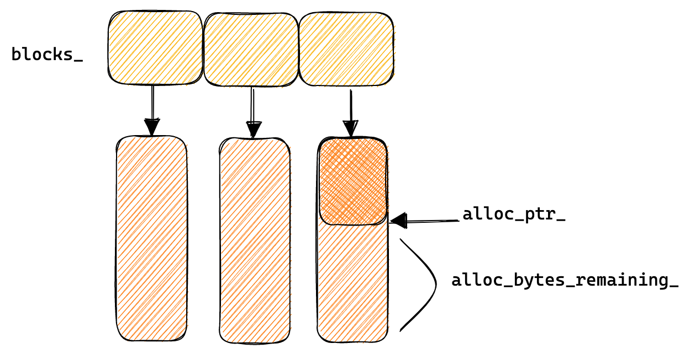

内存池的主要作用是减少 `malloc` 和 `new` 的次数，因为每次内存分配都需要经过系统调用，这种开销是十分巨大的，所以通过内存池可以减少这种开销。

Leveldb 的内存池代码放在 `util/arena.cc` 和 `util/arena.h` 中。

```cpp
class Arena {
 public:
  // ...
 private:
  // ...

  // Allocation state
  char* alloc_ptr_;
  size_t alloc_bytes_remaining_;

  // Array of new[] allocated memory blocks
  std::vector<char*> blocks_;

  // Total memory usage of the arena.
  //
  // TODO(costan): This member is accessed via atomics, but the others are
  //               accessed without any locking. Is this OK?
  std::atomic<size_t> memory_usage_;
};
```
`alloc_ptr_` 指向的是内存块中未分配内存的其实地址的指针

`alloc_bytes_remaining_` 记录当前内存块未分配内存的大小

`blocks_` 申请到的内存块

`memory_usage_` 内存使用量

如下图所示：



---

`Arena` 的内存分配策略有三种：
* 如果 `bytes` 小于等于当前内存块的剩余内存时候，直接在当前内存块上分配内存
* 如果 `bytes` 大于当前内存块剩余内存时候，调用 `AllocateFallback` 函数分配内存
  * 如果 `bytes` 小于等于默认内存块大小的四分之一，新申请一个内存块，大小为默认内存块大小。
  * 如果 `bytes` 大于默认内存块大小的四分之一，新申请一个内存块，大小为 `bytes`，分配内存。

```cpp
inline char* Arena::Allocate(size_t bytes) {
  // The semantics of what to return are a bit messy if we allow
  // 0-byte allocations, so we disallow them here (we don't need
  // them for our internal use).
  assert(bytes > 0);
  // When the bytes is less than alloc_bytes_remaining_,
  // we allocate the memory in this block.
  if (bytes <= alloc_bytes_remaining_) {
    char* result = alloc_ptr_;
    alloc_ptr_ += bytes;
    alloc_bytes_remaining_ -= bytes;
    return result;
  }
  // we need a new memory block.
  return AllocateFallback(bytes);
}
```
Allocate 使用了内联，减小函数调用的开销。
```cpp
char* Arena::AllocateFallback(size_t bytes) {
  if (bytes > kBlockSize / 4) {
    // Object is more than a quarter of our block size.  Allocate it separately
    // to avoid wasting too much space in leftover bytes.
    char* result = AllocateNewBlock(bytes);
    return result;
  }

  // We waste the remaining space in the current block.
  alloc_ptr_ = AllocateNewBlock(kBlockSize);
  alloc_bytes_remaining_ = kBlockSize;

  char* result = alloc_ptr_;
  alloc_ptr_ += bytes;
  alloc_bytes_remaining_ -= bytes;
  return result;
}
```
根据 `bytes` 的大小去 allocate 新的内存块，调用 `AllocateNewBlock`
```cpp
char* Arena::AllocateNewBlock(size_t block_bytes) {
  char* result = new char[block_bytes];
  blocks_.push_back(result);
  memory_usage_.fetch_add(block_bytes + sizeof(char*),
                          std::memory_order_relaxed);
  return result;
}
```
分配新的内存块就是 new 一个新的内存空间，然后存入 `blocks_`，然后增加 `memory_usage_` 的值。

leveldb 还提供了另外一个内存对齐的分配方式：`AllocateAligned`
```cpp
char* Arena::AllocateAligned(size_t bytes) {
  // 计算当前机器要对齐的字节数，最多 8 字节对齐，否则就按照当前机器的 void* 的大小来对齐
  const int align = (sizeof(void*) > 8) ? sizeof(void*) : 8;
  // 字节对齐必须是 2 的次幂
  // x & (x - 1) = 0 表示 x 是 2 的次幂
  static_assert((align & (align - 1)) == 0,
                "Pointer size should be a power of 2");
  
  // A & (B - 1) = A % B
  // reinterpret_cast<uintptr_t> 类型对应机器指针大小
  size_t current_mod = reinterpret_cast<uintptr_t>(alloc_ptr_) & (align - 1);
  // 如果 current_mod = 0 表示 alloc_ptr_ 已经是字节对齐的
  // 否则计算 align - current_mod，表示当前指针地址距离字节对齐的偏差
  size_t slop = (current_mod == 0 ? 0 : align - current_mod);
  // 当前需要分配的字节大小加上对齐偏差就是最终需要分配的总大小
  size_t needed = bytes + slop;
  char* result;
  // 所需的内存小于当前内存块剩余的内存，直接在当前内存块上分配内存
  if (needed <= alloc_bytes_remaining_) {
    result = alloc_ptr_ + slop;
    alloc_ptr_ += needed;
    alloc_bytes_remaining_ -= needed;
  } else {
    // AllocateFallback always returned aligned memory
    result = AllocateFallback(bytes);
  }
  // 保证分配的内存起始地址是字节对齐的
  assert((reinterpret_cast<uintptr_t>(result) & (align - 1)) == 0);
  return result;
}
```